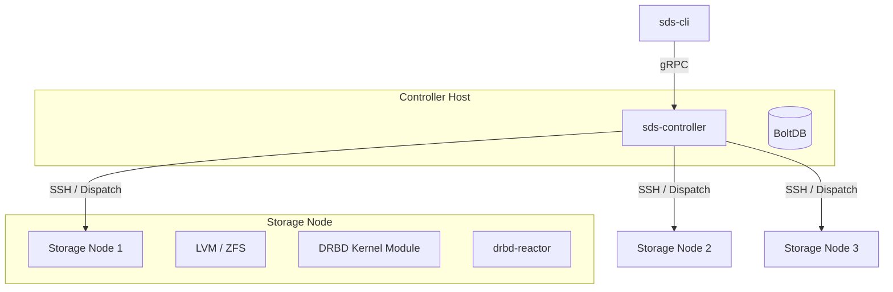

# SDS - Software Defined Storage

Based on DRBD & LINSTOR concepts, a lightweight Software Defined Storage controller written in Go.

English | [简体中文](README_cn.md)

## Architecture

SDS adopts a controller-less agent architecture for storage nodes. The controller communicates with storage nodes via SSH (using the `dispatch` library) to execute commands (`drbdadm`, `lvm`, `zfs`, etc.) and manage configurations.



## Features

- **Storage Management**:
  - **LVM**: Volume Group (VG) and Logical Volume (LV) management.
  - **ZFS**: ZPool and Zvol management.
- **DRBD Resource Management**:
  - Automated resource creation and configuration distribution.
  - Support for advanced DRBD options (e.g., `on-no-quorum`, `c-plan-ahead`).
- **High Availability (HA)**:
  - Integration with `drbd-reactor` for automatic service failover.
  - Support for Virtual IP (VIP) and systemd service management.
- **Gateways**:
  - **iSCSI**: LIO-based iSCSI target management with HA.
  - **NFS**: NFSv4 export management with HA.
  - **NVMe-oF**: NVMe over Fabrics target management.
- **Snapshots**:
  - Support for both LVM and ZFS snapshots.

## Project Structure

```text
sds/
├── cmd/
│   ├── cli/              # Command line interface (sds-cli)
│   └── controller/       # Controller service (sds-controller)
├── pkg/
│   ├── client/           # gRPC client library
│   ├── controller/       # Core controller logic
│   ├── database/         # BoltDB persistence layer
│   ├── deployment/       # SSH execution engine (wraps dispatch)
│   ├── gateway/          # Gateway (iSCSI/NFS/NVMe) managers
│   ├── config/           # Configuration parsing
│   └── util/             # Utilities
├── api/proto/v1/         # gRPC Protocol Buffers definitions
├── configs/              # Configuration examples and systemd units
└── scripts/              # Deployment scripts
```

## Getting Started

### Prerequisites

- **Controller Node**: Go 1.22+, `make`, `protoc`.
- **Storage Nodes**:
  - Linux (Ubuntu/Debian/RHEL).
  - SSH access from Controller (root user recommended for management).
  - **LVM2** installed (for LVM pools).
  - **ZFS** installed (for ZFS pools, e.g., `zfsutils-linux`).
  - **DRBD 9** kernel module and **drbd-utils** installed.
  - **drbd-reactor** installed (for HA/Gateway features).
  - **resource-agents-extra** installed (for VIP and service management).

### Installation

1.  **Build**:

    ```bash
    make build
    ```

2.  **Deploy**:
    Use the automated deployment script to deploy to the controller node (`orange1` in this example) and distribute the CLI.
    ```bash
    ./scripts/deploy-all.sh --hosts "orange1,orange2,orange3"
    ```

### Configuration

The controller configuration is located at `/etc/sds/controller.toml`.

```toml
[server]
listen_address = "0.0.0.0"
port = 3374

[dispatch]
# SSH configuration for connecting to storage nodes
ssh_user = "root"
ssh_key_path = "/root/.ssh/id_rsa"
parallel = 10
# Initial hosts list (can also be managed via 'sds-cli node register')
hosts = ["orange1", "orange2", "orange3"]

[database]
path = "/var/lib/sds/sds.db"

[storage]
default_pool_type = "vg"
```

## Usage Examples

### 1. Node Management

```bash
# Register storage nodes
sds-cli node register --name orange1 --address 192.168.123.214
sds-cli node register --name orange2 --address 192.168.123.215

# List nodes
sds-cli node list
```

### 2. Storage Pool Management

```bash
# Create LVM pool (VG)
sds-cli pool create --name data-pool --type lvm --node orange1 --devices /dev/sdb

# Create LVM Thin pool
sds-cli pool create --name thin-pool --type lvm-thin --node orange1 --devices /dev/sdc

# Create ZFS pool
sds-cli pool create --name tank --type zfs --node orange1 --devices /dev/sdd

# Create ZFS Thin pool (sparse)
sds-cli pool create --name tank-thin --type zfs-thin --node orange1 --devices /dev/sde
```

### 3. Resource Management

```bash
# Create a DRBD resource backed by LVM
sds-cli resource create --name res01 --port 7001 --size 10G --nodes orange1,orange2 --pool data-pool

# Create a DRBD resource backed by ZFS
sds-cli resource create --name res-zfs --port 7002 --size 10G --nodes orange1,orange2 --pool tank --storage-type zfs

# Set Primary
sds-cli resource primary res01 orange1 --force

# Create Filesystem and Mount
sds-cli resource fs res01 0 ext4 --node orange1
sds-cli resource mount res01 0 /mnt/res01 --node orange1
```

### 4. Gateway & HA Management

```bash
# Create an iSCSI Gateway with HA
sds-cli gateway iscsi create \
    --resource iscsi-gw \
    --service-ip 192.168.123.200/24 \
    --iqn iqn.2024-01.com.example:storage.target01

# Create an NFS Gateway with HA
sds-cli gateway nfs create \
    --resource nfs-gw \
    --service-ip 192.168.123.201/24 \
    --export-path /data/share
```

## License

Apache License 2.0
