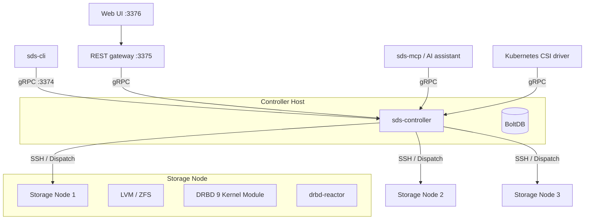

# SDS - Software Defined Storage

Based on DRBD & LINSTOR concepts, a lightweight Software Defined Storage controller written in Go. It manages storage pools, replicated DRBD volumes, storage gateways (iSCSI/NFS/NVMe-oF) and high availability, and integrates with Kubernetes via a native CSI driver.

English | [简体中文](README_cn.md)

## Architecture

SDS uses an agent-less architecture for storage nodes. A single controller drives every node over SSH (via the `dispatch` library) to run `drbdadm`, `lvm`, `zfs` and `drbd-reactor` commands and distribute configuration. State is persisted in an embedded BoltDB. Clients talk to the controller over gRPC (`sds-cli`), a REST gateway, an embedded web UI, an MCP server (for AI assistants), and the Kubernetes CSI driver.


```mermaid
graph TD
    CLI[sds-cli] -->|gRPC :3374| CTRL[sds-controller]
    UI[Web UI :3376] --> REST[REST gateway :3375]
    REST -->|gRPC| CTRL
    MCP[sds-mcp / AI assistant] -->|gRPC| CTRL
    K8S[Kubernetes CSI driver] -->|gRPC| CTRL

    subgraph Controller Host
    CTRL
    DB[(BoltDB)]
    end

    CTRL -->|SSH / Dispatch| Node1[Storage Node 1]
    CTRL -->|SSH / Dispatch| Node2[Storage Node 2]
    CTRL -->|SSH / Dispatch| Node3[Storage Node 3]

    subgraph Storage Node
    Node1
    LVM[LVM / ZFS]
    DRBD[DRBD 9 Kernel Module]
    Reactor[drbd-reactor]
    end
```

## Features

- **Storage pools**: LVM (VG), LVM-thin, and ZFS (zpool / thin) pool management.
- **DRBD resources**:
  - Automated resource creation, config distribution, and adjustment.
  - Advanced DRBD options (`on-no-quorum`, `c-plan-ahead`, quorum, etc.).
  - Online volume expansion; add / remove / resize volumes.
- **Placement**: capacity-first automatic replica placement with LINSTOR-style
  constraints — rack/zone-aware (`replicas-on-different`), `replicas-on-same`,
  and `do-not-place-with`. Give `--nodes` to place manually or omit it to
  auto-place.
- **Diskless clients**: a node with no local replica can attach a resource and
  do I/O over the DRBD network (`resource diskless attach`), plus automatic
  quorum tiebreakers.
- **High Availability**:
  - `drbd-reactor` promoter integration for automatic service failover.
  - Floating Virtual IP (VIP) + systemd service ordering.
  - **Self-HA**: the controller itself can run behind a floating VIP.
- **Gateways** (DRBD resource + drbd-reactor promoter config):
  - **iSCSI** (LIO): targets, LUNs, initiator ACLs, CHAP.
  - **NFS** (NFSv4): exports management.
  - **NVMe-oF**: subsystems, namespaces, host ACLs.
- **Kubernetes (CSI)**: dynamic provisioning of DRBD volumes, pool-aware replica
  placement, `WaitForFirstConsumer` topology, and opt-in diskless remote access
  (`allowRemoteVolumeAccess`) so Pods can run on non-replica nodes.
- **Encryption at rest**: `resource create --encrypt` puts a LUKS2 container
  between DRBD and the backing volume on every replica (`DRBD → LUKS → LVM`).
  **At rest only — DRBD sits above the crypt layer, so replication traffic
  between nodes is plaintext.** See [Encryption at rest](#encryption-at-rest).
- **Snapshots**: LVM and ZFS snapshots, plus GFS (grandfather-father-son)
  retention schedules.
- **Cross-DC (WAN)**: a TCP proxy for running DRBD replication across NAT/WAN
  where inbound UDP is blocked.
- **Security & Ops**: token auth, RBAC, audit logging, optional TLS, and
  Prometheus metrics.
- **Notifications**: a health detector that raises events for degraded replicas,
  failovers, lost Primaries, unreachable nodes and broken WAN links, delivered
  by Webhook, by gRPC/REST watch stream, by SSE to the web UI's notification
  bell, or by `sds-cli event watch`.
- **Web UI**: an embedded single-page UI served by the controller.
- **AI Integration (MCP)**: `sds-mcp` exposes 81 management tools over the Model
  Context Protocol for AI assistants (Claude Code, Claude Desktop, etc.).

## Interfaces & default ports

| Interface        | Default port | Notes                                   |
| ---------------- | ------------ | --------------------------------------- |
| gRPC API         | 3374         | `sds-cli`, CSI, MCP                     |
| REST gateway     | 3375         | grpc-gateway JSON API                    |
| Web UI           | 3376         | embedded SPA                             |
| Prometheus       | 9433         | `metrics.enabled`                        |

## Project Structure

```text
sds/
├── cmd/
│   ├── cli/              # Command line interface (sds-cli)
│   ├── controller/       # Controller service (sds-controller)
│   ├── csi-controller/   # Kubernetes CSI controller plugin
│   ├── csi-node/         # Kubernetes CSI node plugin
│   ├── mcp/              # MCP server for AI assistants (sds-mcp)
│   └── sds-ai/           # AI Copilot service
├── pkg/
│   ├── client/           # gRPC client library
│   ├── controller/       # Core controller logic + gRPC/REST/UI servers
│   ├── csi/              # CSI driver (controller + node services)
│   ├── database/         # BoltDB persistence layer
│   ├── deployment/       # SSH execution engine (wraps dispatch)
│   ├── gateway/          # Gateway (iSCSI/NFS/NVMe-oF) managers
│   ├── reactor/          # drbd-reactor promoter config generation
│   ├── mcpserver/        # MCP tool definitions and handlers
│   ├── wanproxy/         # Cross-DC DRBD-over-TCP proxy
│   ├── alert/            # Health detector (degrade, failover, node loss)
│   ├── event/            # Notification bus, history, and Webhook delivery
│   ├── rbac/             # Role-based access control
│   ├── metrics/          # Prometheus metrics
│   ├── config/           # Configuration parsing
│   └── util/             # Utilities
├── api/proto/v1/         # gRPC Protocol Buffers definitions
├── ui/                   # Embedded web UI (go:embed of the built SPA)
├── web-ui/               # Web UI source (React/TypeScript)
├── deploy/k8s/           # Kubernetes CSI manifests
├── configs/              # Configuration examples and systemd units
└── scripts/              # Deployment scripts
```

## Getting Started

### Prerequisites

- **Controller Node**: Go 1.25+, `make`, `protoc` (only needed to regenerate protobufs).
- **Storage Nodes**:
  - Linux (Ubuntu/Debian/RHEL), reachable over SSH from the controller (root recommended).
  - **LVM2** (for LVM pools) and/or **ZFS** (`zfsutils-linux`, for ZFS pools).
  - **DRBD 9** kernel module and **drbd-utils**.
  - **drbd-reactor** (for HA / gateways).
  - **resource-agents** / `resource-agents-extra` (for VIP and service OCF agents).

### Installation

1. **Build**:

   ```bash
   make build
   ```

2. **Deploy** to the controller and distribute the CLI:

   ```bash
   ./scripts/deploy-all.sh --hosts "orange1,orange2,orange3"
   ```

## Configuration

The controller configuration lives at `/etc/sds/controller.toml`:

```toml
[server]
listen_address = "0.0.0.0"
port = 3374              # gRPC (REST 3375 and UI 3376 are derived)

[database]
path = "/var/lib/sds/sds.db"

[auth]
enabled = true
token = "change-me"     # bearer token; also read from /etc/sds/token

[storage]
default_pool_type = "vg"

[metrics]
enabled = true
listen_address = "0.0.0.0"
port = 9433

[resource]
auto_tiebreaker = true  # auto-add a diskless quorum tiebreaker for 2-replica resources

# Optional: run the controller behind a floating VIP
[self_ha]
enabled = false

# Optional: health detection and notifications.
#
# `enabled` starts the detector and the event bus on its own. Delivery is
# separate: with no webhook configured the events are still readable at
# GET /v1/events, streamed at GET /v1/events/watch, pushed to the web UI's
# notification bell over GET /v1/events/stream, and followed with
# `sds-cli event watch`.
[alert]
enabled = false
check_interval_sec = 60
check_nodes = true      # SSH-probe each node per poll; produces node.unreachable
history_size = 500      # events retained for clients that connect late

# Single-receiver shorthand.
webhook_url = ""
webhook_min_severity = "warning"   # info | warning | critical

# Additional receivers, each with its own threshold — a pager on critical,
# a chat channel on everything.
# [[alert.webhooks]]
# url = "https://chat.example.com/hooks/sds"
# min_severity = "info"
# headers = { X-Token = "..." }
```

### Cross-site (WAN) maintenance

A WAN resource has one replication tunnel ("leg") per primary-site node, each a
systemd instance named after that node. If a node is renumbered or removed, its
leg can be left behind — still running, but no longer what the controller
expects. `wan repair` reconciles the two:

```bash
sds-cli wan repair <resource> --dry-run   # show the plan; touches nothing
sds-cli wan repair <resource>
```

It converges, so running it on a healthy resource reports nothing to do. The
repair restarts tunnels, so use `--dry-run` first.

### Notifications

Event types: `resource.degraded`, `resource.failover`, `resource.no_primary`,
`resource.promoted`, `node.unreachable`, `wan.degraded`. Each carries a
`severity` (`info`/`warning`/`critical`) and a `status` (`firing` when a
condition starts, `resolved` when it clears), so a receiver can pair an alert
with its recovery instead of reading the recovery as a new fault.

```bash
# Follow live, or replay what the controller still holds
sds-cli event watch
sds-cli event watch --min-severity critical --type resource.failover
sds-cli event list --replay --json

# Same events over REST (newline-delimited JSON)
curl -N http://controller:3375/v1/events/watch

# Browser-friendly SSE, which is what the web UI's bell subscribes to
curl -N http://controller:3375/v1/events/stream
```

Event ids are monotonic, so a client that sees a gap knows it fell behind rather
than that nothing happened; reconnecting with `since_id` resumes without
replaying what was already seen. A subscriber that stops reading loses its own
events rather than blocking the detector.

SSH access to storage nodes is **not** configured here — the `dispatch` library
reads its own `~/.dispatch/config.toml` (SSH user, key, and host→address map).
Hosts can also be managed at runtime with `sds-cli node register`.

## Usage Examples

### 1. Node Management

```bash
sds-cli node register --name orange1 --address 192.168.123.214
sds-cli node register --name orange2 --address 192.168.123.215
sds-cli node list
sds-cli health-check
```

### 2. Storage Pool Management

```bash
# LVM VG / thin / ZFS
sds-cli pool create --name data-pool --type lvm      --nodes orange1 --devices /dev/sdb
sds-cli pool create --name thin-pool --type lvm-thin --nodes orange1 --devices /dev/sdc
sds-cli pool create --name tank      --type zfs      --nodes orange1 --devices /dev/sdd
sds-cli pool list

# Storage tiering: put an SSD in front of one node's thin pool (lvmcache).
# The whole device is consumed and the cache serves every volume in the pool.
sds-cli pool add-cache --node orange1 --pool thin-pool --device /dev/nvme0n1

# Flush the cache, detach it, and give the device back. The detach is verified,
# so a cache that could not be flushed is reported as a failure.
sds-cli pool remove-cache --node orange1 --pool thin-pool
```

The cache defaults to **writethrough**: a write is acknowledged only once it has
reached the slow disk, so losing the SSD costs performance and nothing else.
`--mode writeback` acknowledges writes from the SSD and destages them later —
losing that one device then loses every write it had not yet written down, and
only a replica that happens to hold them can give them back, which a resyncing
peer or a correlated failure will not. `sds-cli pool get` shows how much of a
writeback cache is dirty, which is the size of that window right now.

### 3. Resource Management

```bash
# Create a replicated DRBD resource (omit --nodes to auto-place by free space)
sds-cli resource create --name res01 --port 7001 --size 10G --nodes orange1,orange2 --pool data-pool

# ZFS-backed resource
sds-cli resource create --name res-zfs --port 7002 --size 10G --nodes orange1,orange2 --pool tank --storage-type zfs

# Promote, make a filesystem, mount
sds-cli resource primary res01 orange1 --force
sds-cli resource fs res01 0 ext4 --node orange1
sds-cli resource mount res01 0 /mnt/res01 --node orange1

# Online expansion
sds-cli resource resize-volume res01 0 20G

# Encrypted at rest (see the section below before using this)
sds-cli resource create --name res-enc --port 7003 --size 10G --nodes orange1,orange2 --pool data-pool --encrypt
```

#### Encryption at rest

`--encrypt` wraps each replica's backing volume in a LUKS2 container, so the
stack becomes `DRBD → LUKS → LVM` and the pool disks hold ciphertext.

**DRBD replicates plaintext.** The crypt layer is *below* DRBD, so what travels
between nodes over the replication link is exactly as unencrypted as it was
before. If you need the wire protected, that is a separate problem (a VPN, or
`sds-proxy`'s mTLS tunnel for the WAN case) — `--encrypt` does not address it.

What it does protect: a pool disk that leaves the building. RMA, decommission,
theft of the drives. Since each node keeps its key on its own root filesystem,
it does **not** protect a whole server that walks out of the rack.

Key handling:

- Each node generates its own 512-bit key from `/dev/urandom`, **on the node**.
  Keys are never sent over SSH, never reach the controller, and appear in no
  log, no audit record and no database.
- They live in `/etc/sds/luks/` (directory `0700`, key files `0400`, root-owned)
  and are only ever handed to `cryptsetup` as `--key-file`, never as an argument.
- There is **no central escrow**. Losing a node's root filesystem loses that
  node's key, and with it that node's copy of the ciphertext. The peers hold the
  same data under their own keys, so DRBD rebuilds the replica — but you cannot
  recover a lone surviving disk whose node is gone.
- `resource delete` overwrites and removes the keys on every node before the
  backing volumes are released.

Containers are reopened at boot by `sds-drbd-up.service`, after LVM activation
and before `drbdadm adjust`, so an encrypted resource survives a reboot and a
failover without operator action. Every replica — Primary and Secondary alike —
opens its own container, because a Secondary needs its backing device too.

Limits, deliberately:

- LVM pools only. ZFS has its own dataset-level encryption; a crypt layer under
  DRBD on a zvol is refused rather than half-supported.
- It cannot be turned on (or off) after creation. Converting in place would mean
  destroying and resyncing each replica in turn, and a failure halfway would
  leave some replicas encrypted and some not with nothing in the config to say
  which. Asking for it on an existing resource is refused with an explanation.
- Every node holding a replica needs `cryptsetup` and a kernel with `dm-crypt`;
  this is checked before anything is provisioned.

### 4. Diskless Clients

```bash
# Let a node with no local replica mount the resource over the network
sds-cli resource diskless attach res01 orange3
sds-cli resource diskless detach res01 orange3
```

### 5. Gateways & HA

```bash
# iSCSI gateway with HA
sds-cli gateway iscsi create \
    --resource iscsi-gw \
    --service-ip 192.168.123.200/24 \
    --iqn iqn.2024-01.com.example:storage.target01

# NFS gateway with HA
sds-cli gateway nfs create \
    --resource nfs-gw \
    --service-ip 192.168.123.201/24 \
    --export-path /data/share

# NVMe-oF gateway
sds-cli gateway nvme create \
    --resource nvme-gw \
    --service-ip 192.168.123.202/24 \
    --nqn nqn.2024-01.com.example:storage.subsys01
```

### 6. Snapshots

```bash
sds-cli resource snapshot create --resource res01 --name res01_snap --node orange1
sds-cli resource snapshot list   --resource res01 --node orange1
# GFS-retention schedule
sds-cli resource snapshot schedule create --resource res01 --cron "0 * * * *" --keep-hourly 6 --keep-daily 7
```

### 7. Kubernetes (CSI)

The CSI driver provisions DRBD volumes as PersistentVolumes. Apply the manifests
in `deploy/k8s/` (set the endpoint to your controller's address), then use the
`sds-drbd` StorageClass:

```yaml
apiVersion: storage.k8s.io/v1
kind: StorageClass
metadata: { name: sds-drbd }
provisioner: sds.csi.liliang-cn.com
parameters:
  pool: "vg0"
  replicas: "2"
  storageType: "lvm"
  # allowRemoteVolumeAccess: "true"   # opt-in: run Pods on non-replica nodes (diskless)
volumeBindingMode: WaitForFirstConsumer
reclaimPolicy: Delete
```

Replica placement is pool-aware: volumes only land on nodes that host the
requested pool.

### 8. AI Assistants (MCP)

`sds-mcp` serves the full management surface (81 tools: pools, resources,
snapshots, gateways, HA, ZFS, topology, and observability) over the Model Context
Protocol on stdio. Destructive operations are annotated so MCP clients ask for
confirmation, and `--read-only` restricts the server to list/status/health tools.

Three of them answer what the cluster *did* rather than what it is, which is
most of what anyone asks after something goes wrong: `sds_event_list`
(degrade / failover / node-loss notifications), `sds_audit_list` (who called
what), and `sds_log_list` (the active controller's own log).

```bash
# Register with Claude Code
claude mcp add sds -- sds-mcp --controller orange1:3374

# Monitoring-only access
claude mcp add sds-ro -- sds-mcp --controller orange1:3374 --read-only
```

The API token is resolved like sds-cli: `--token` flag, `SDS_TOKEN` env,
`~/.sds/token`, then `/etc/sds/token`.

## License

Apache License 2.0
