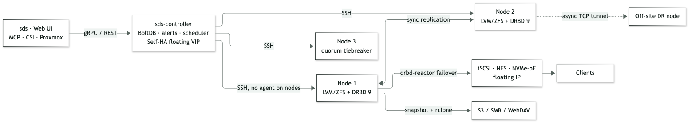

# SDS - Software Defined Storage

A lightweight DRBD 9 storage controller written in Go. It manages storage pools, replicated volumes, iSCSI / NFS / NVMe-oF gateways and high availability, and plugs into Kubernetes (CSI), Proxmox VE and AI assistants (MCP).

English | [简体中文](README_cn.md)



No agent runs on the storage nodes: one controller drives them over SSH and keeps its state in an embedded BoltDB. The controller itself can run behind a floating VIP (Self-HA).

## Features

- **Pools**: LVM, LVM-thin, ZFS. SSD caching for thin pools.
- **Resources**: replicated DRBD volumes with automatic placement, online resize, diskless clients, quorum tiebreakers, LUKS2 encryption at rest, TLS-encrypted replication.
- **Gateways**: iSCSI, NFS, NVMe-oF, each failing over with drbd-reactor and a floating IP.
- **Snapshots and backups**: LVM / ZFS snapshots with retention schedules; scheduled, incremental backups to S3, SMB or WebDAV, restorable on a rebuilt or different cluster.
- **Cross-site**: asynchronous DR replicas over a TCP tunnel that works through NAT.
- **Integrity**: scheduled DRBD verify with resync, alerts on degraded replicas, lost Primaries, out-of-sync data and full pools.
- **Kubernetes**: CSI driver with snapshots, clones, expansion, raw block and remote (diskless) access.
- **AI**: MCP server for Claude Code, ChatGPT and others (local or remote with role-scoped tokens and OAuth), plus a Copilot in the web UI.
- **Operations**: token auth, RBAC, audit log, TLS, Prometheus metrics, notifications to Feishu / Slack / WeCom / DingTalk / webhooks.

## Install

Storage nodes need DRBD 9 (kernel module and `drbd-utils`), `drbd-reactor`, `resource-agents`, and LVM and/or ZFS. The controller host needs Go 1.25+.

```bash
make build
./scripts/deploy-all.sh --hosts "node1,node2,node3"
```

Step-by-step: [docs/deployment-guide.md](docs/deployment-guide.md), node requirements: [docs/node-prerequisites.md](docs/node-prerequisites.md).

## Use

```bash
sds-cli node register --name node1 --address 192.168.1.11
sds-cli pool create --name pool0 --type lvm-thin --nodes node1,node2 --devices /dev/sdb
sds-cli resource create --name data --port 7001 --size 10G --nodes node1,node2 --pool pool0
sds-cli gateway nfs create --resource data --service-ip 192.168.1.200/24 --export-path /data
```

Kubernetes: `kubectl apply -f deploy/k8s/`, then use the `sds-drbd` StorageClass ([deploy/k8s/README.md](deploy/k8s/README.md)).

AI assistants:

```bash
claude mcp add sds -- sds-mcp --controller node1:3374            # local
claude mcp add --transport http sds https://<host>/mcp \
    --header "Authorization: Bearer <token>"                     # remote
```

## Ports

| Port | Service |
| ---- | ------- |
| 3374 | gRPC (`sds-cli`, CSI, MCP) |
| 3375 | REST |
| 3376 | Web UI |
| 9433 | Prometheus |

Controller config: `/etc/sds/controller.toml`.

## Documentation

| Guide | For |
| ----- | --- |
| [docs/user-guide.md](docs/user-guide.md) | Day-to-day use and troubleshooting. Start here. |
| [docs/deployment-guide.md](docs/deployment-guide.md) | Building a cluster from nothing. |
| [docs/node-prerequisites.md](docs/node-prerequisites.md) | What each node needs installed. |
| [docs/mcp.md](docs/mcp.md) | Local and remote MCP, tokens, runbooks. |

## License

Apache License 2.0
