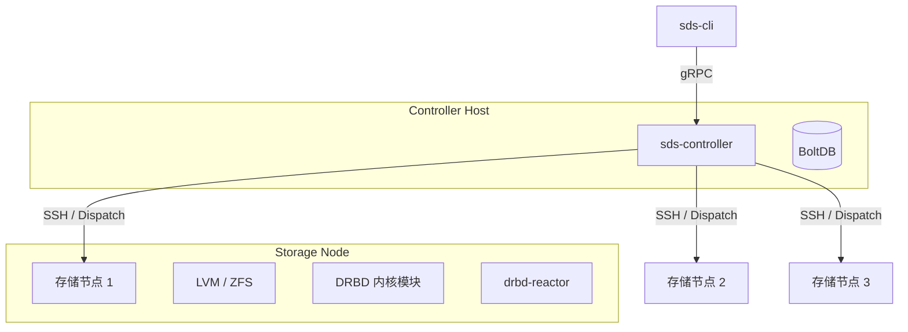

# SDS - 软件定义存储

基于 DRBD 和 LINSTOR 概念，使用 Go 编写的轻量级软件定义存储控制器。

[English](README.md) | 简体中文

## 架构

SDS 采用无代理架构管理存储节点。控制器通过 SSH（使用 `dispatch` 库）与存储节点通信，执行命令（`drbdadm`、`lvm`、`zfs` 等）并管理配置。



## 特性

- **存储管理**：
  - **LVM**：卷组（VG）和逻辑卷（LV）管理。
  - **ZFS**：ZPool 和 Zvol 管理。
- **DRBD 资源管理**：
  - 自动化资源创建和配置分发。
  - 支持高级 DRBD 选项（如 `on-no-quorum`、`c-plan-ahead`）。
- **高可用（HA）**：
  - 集成 `drbd-reactor` 实现服务自动故障转移。
  - 支持虚拟 IP（VIP）和 systemd 服务管理。
- **网关**：
  - **iSCSI**：基于 LIO 的 iSCSI 目标管理，支持 HA。
  - **NFS**：NFSv4 导出管理，支持 HA。
  - **NVMe-oF**：NVMe over Fabrics 目标管理。
- **快照**：
  - 支持 LVM 和 ZFS 快照。

## 项目结构

```text
sds/
├── cmd/
│   ├── cli/              # 命令行界面 (sds-cli)
│   └── controller/       # 控制器服务 (sds-controller)
├── pkg/
│   ├── client/           # gRPC 客户端库
│   ├── controller/       # 核心控制器逻辑
│   ├── database/         # BoltDB 持久化层
│   ├── deployment/       # SSH 执行引擎（封装 dispatch）
│   ├── gateway/          # 网关（iSCSI/NFS/NVMe）管理器
│   ├── config/           # 配置解析
│   └── util/             # 工具函数
├── api/proto/v1/         # gRPC Protocol Buffers 定义
├── configs/              # 配置示例和 systemd 单元文件
└── scripts/              # 部署脚本
```

## 快速开始

### 前置要求

- **控制器节点**：Go 1.22+、`make`、`protoc`。
- **存储节点**：
  - Linux（Ubuntu/Debian/RHEL）。
  - 从控制器可通过 SSH 访问（推荐使用 root 用户进行管理）。
  - 安装 **LVM2**（用于 LVM 池）。
  - 安装 **ZFS**（用于 ZFS 池，例如 `zfsutils-linux`）。
  - 安装 **DRBD 9** 内核模块和 **drbd-utils**。
  - 安装 **drbd-reactor**（用于 HA/网关功能）。
  - 安装 **resource-agents-extra**（用于 VIP 和服务管理）。

### 安装

1.  **构建**：

    ```bash
    make build
    ```

2.  **部署**：
    使用自动化部署脚本部署到控制器节点（本例中为 `orange1`）并分发 CLI。
    ```bash
    ./scripts/deploy-all.sh --hosts "orange1,orange2,orange3"
    ```

### 配置

控制器配置文件位于 `/etc/sds/controller.toml`。

```toml
[server]
listen_address = "0.0.0.0"
port = 3374

[dispatch]
# 连接存储节点的 SSH 配置
ssh_user = "root"
ssh_key_path = "/root/.ssh/id_rsa"
parallel = 10
# 初始主机列表（也可通过 'sds-cli node register' 管理）
hosts = ["orange1", "orange2", "orange3"]

[database]
path = "/var/lib/sds/sds.db"

[storage]
default_pool_type = "vg"
```

## 使用示例

### 1. 节点管理

```bash
# 注册存储节点
sds-cli node register --name orange1 --address 192.168.123.214
sds-cli node register --name orange2 --address 192.168.123.215

# 列出节点
sds-cli node list
```

### 2. 存储池管理

```bash
# 创建 LVM 池（VG）
sds-cli pool create --name data-pool --type lvm --node orange1 --devices /dev/sdb

# 创建 LVM Thin 池
sds-cli pool create --name thin-pool --type lvm-thin --node orange1 --devices /dev/sdc

# 创建 ZFS 池
sds-cli pool create --name tank --type zfs --node orange1 --devices /dev/sdd

# 创建 ZFS Thin 池（稀疏卷）
sds-cli pool create --name tank-thin --type zfs-thin --node orange1 --devices /dev/sde
```

### 3. 资源管理

```bash
# 创建基于 LVM 的 DRBD 资源
sds-cli resource create --name res01 --port 7001 --size 10G --nodes orange1,orange2 --pool data-pool

# 创建基于 ZFS 的 DRBD 资源
sds-cli resource create --name res-zfs --port 7002 --size 10G --nodes orange1,orange2 --pool tank --storage-type zfs

# 设置为主节点
sds-cli resource primary res01 orange1 --force

# 创建文件系统并挂载
sds-cli resource fs res01 0 ext4 --node orange1
sds-cli resource mount res01 0 /mnt/res01 --node orange1
```

### 4. 网关和高可用管理

```bash
# 创建具有 HA 的 iSCSI 网关
sds-cli gateway iscsi create \
    --resource iscsi-gw \
    --service-ip 192.168.123.200/24 \
    --iqn iqn.2024-01.com.example:storage.target01

# 创建具有 HA 的 NFS 网关
sds-cli gateway nfs create \
    --resource nfs-gw \
    --service-ip 192.168.123.201/24 \
    --export-path /data/share
```

## 许可证

Apache License 2.0
