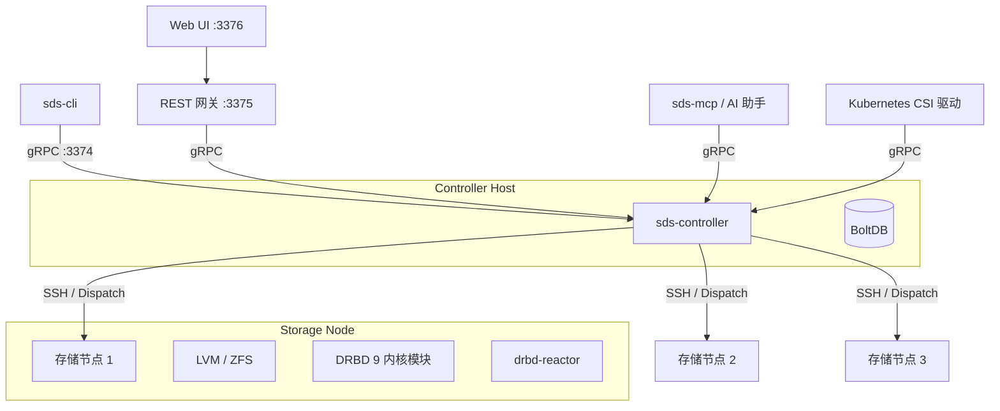

# SDS - 软件定义存储

基于 DRBD 和 LINSTOR 概念，使用 Go 编写的轻量级软件定义存储控制器。它管理存储池、DRBD 复制卷、存储网关（iSCSI/NFS/NVMe-oF）与高可用，并通过原生 CSI 驱动接入 Kubernetes。

[English](README.md) | 简体中文

## 架构

SDS 采用无代理架构管理存储节点。单个控制器通过 SSH（使用 `dispatch` 库）驱动每个节点执行 `drbdadm`、`lvm`、`zfs`、`drbd-reactor` 命令并分发配置，状态持久化在内嵌的 BoltDB 中。客户端通过 gRPC（`sds-cli`）、REST 网关、内嵌 Web UI、MCP 服务（供 AI 助手使用）以及 Kubernetes CSI 驱动与控制器交互。


```mermaid
graph TD
    CLI[sds-cli] -->|gRPC :3374| CTRL[sds-controller]
    UI[Web UI :3376] --> REST[REST 网关 :3375]
    REST -->|gRPC| CTRL
    MCP[sds-mcp / AI 助手] -->|gRPC| CTRL
    K8S[Kubernetes CSI 驱动] -->|gRPC| CTRL

    subgraph Controller Host
    CTRL
    DB[(BoltDB)]
    end

    CTRL -->|SSH / Dispatch| Node1[存储节点 1]
    CTRL -->|SSH / Dispatch| Node2[存储节点 2]
    CTRL -->|SSH / Dispatch| Node3[存储节点 3]

    subgraph Storage Node
    Node1
    LVM[LVM / ZFS]
    DRBD[DRBD 9 内核模块]
    Reactor[drbd-reactor]
    end
```

## 特性

- **存储池**：LVM（VG）、LVM-thin、ZFS（zpool / thin）池管理。
- **DRBD 资源**：
  - 自动化资源创建、配置分发与调整。
  - 支持高级 DRBD 选项（`on-no-quorum`、`c-plan-ahead`、quorum 等）。
  - 在线扩容；增加 / 删除 / 调整卷。
- **放置策略**：容量优先的自动副本放置，支持 LINSTOR 风格约束——机架/区域感知
  （`replicas-on-different`）、`replicas-on-same`、`do-not-place-with`。指定 `--nodes`
  手动放置，或省略以自动放置。
- **无盘客户端（diskless）**：无本地副本的节点也可挂载资源，I/O 走 DRBD 网络
  （`resource diskless attach`），并支持自动 quorum 仲裁票（tiebreaker）。
- **高可用**：
  - 集成 `drbd-reactor` promoter 实现服务自动故障转移。
  - 浮动虚拟 IP（VIP）+ systemd 服务顺序编排。
  - **Self-HA**：控制器自身也可运行在浮动 VIP 之后。
- **网关**（DRBD 资源 + drbd-reactor promoter 配置）：
  - **iSCSI**（LIO）：目标、LUN、发起端 ACL、CHAP。
  - **NFS**（NFSv4）：导出管理。
  - **NVMe-oF**：子系统、命名空间、主机 ACL。
- **Kubernetes（CSI）**：动态供给 DRBD 卷、pool 感知的副本放置、
  `WaitForFirstConsumer` 拓扑，以及可选的无盘远程访问（`allowRemoteVolumeAccess`），
  让 Pod 可以调度到非副本节点。
- **静态加密**：`resource create --encrypt` 在每个副本的 DRBD 与后端卷之间放入一层
  LUKS2 容器（`DRBD → LUKS → LVM`）。**仅是静态加密——DRBD 位于加密层之上，
  节点之间的复制流量仍是明文。** 见 [静态加密](#静态加密)。
- **快照**：LVM 和 ZFS 快照，以及 GFS（祖父-父-子）保留策略计划任务。
- **跨数据中心（WAN）**：当入站 UDP 被封禁时，通过 TCP 代理在 NAT/WAN 上运行 DRBD 复制。
- **安全与运维**：令牌认证、RBAC、审计日志、可选 TLS、Prometheus 指标。
- **通知**：健康检测器会为副本降级、主备切换（failover）、失去 Primary、节点失联
  和 WAN 链路中断产生事件，可通过 Webhook 回调、gRPC/REST 监听流、推送到 Web UI
  通知铃铛的 SSE，或 `sds-cli event watch` 送达。
- **Web UI**：控制器内嵌的单页 Web 界面。
- **AI 集成（MCP）**：`sds-mcp` 通过 Model Context Protocol 暴露 81 个管理工具，
  供 AI 助手（Claude Code、Claude Desktop 等）使用。

## 接口与默认端口

| 接口          | 默认端口 | 说明                          |
| ------------- | -------- | ----------------------------- |
| gRPC API      | 3374     | `sds-cli`、CSI、MCP           |
| REST 网关     | 3375     | grpc-gateway JSON API         |
| Web UI        | 3376     | 内嵌 SPA                      |
| Prometheus    | 9433     | `metrics.enabled`             |

## 项目结构

```text
sds/
├── cmd/
│   ├── cli/              # 命令行界面 (sds-cli)
│   ├── controller/       # 控制器服务 (sds-controller)
│   ├── csi-controller/   # Kubernetes CSI 控制器插件
│   ├── csi-node/         # Kubernetes CSI 节点插件
│   ├── mcp/              # 供 AI 助手使用的 MCP 服务 (sds-mcp)
│   └── sds-ai/           # AI Copilot 服务
├── pkg/
│   ├── client/           # gRPC 客户端库
│   ├── controller/       # 核心控制器逻辑 + gRPC/REST/UI 服务
│   ├── csi/              # CSI 驱动（controller + node 服务）
│   ├── database/         # BoltDB 持久化层
│   ├── deployment/       # SSH 执行引擎（封装 dispatch）
│   ├── gateway/          # 网关（iSCSI/NFS/NVMe-oF）管理器
│   ├── reactor/          # drbd-reactor promoter 配置生成
│   ├── mcpserver/        # MCP 工具定义与处理器
│   ├── wanproxy/         # 跨数据中心 DRBD-over-TCP 代理
│   ├── alert/            # 健康检测器（降级、切换、节点失联）
│   ├── event/            # 通知总线、历史缓冲与 Webhook 投递
│   ├── rbac/             # 基于角色的访问控制
│   ├── metrics/          # Prometheus 指标
│   ├── config/           # 配置解析
│   └── util/             # 工具函数
├── api/proto/v1/         # gRPC Protocol Buffers 定义
├── ui/                   # 内嵌 Web UI（go:embed 构建产物）
├── web-ui/               # Web UI 源码（React/TypeScript）
├── deploy/k8s/           # Kubernetes CSI 部署清单
├── configs/              # 配置示例和 systemd 单元文件
└── scripts/              # 部署脚本
```

## 快速开始

### 前置要求

- **控制器节点**：Go 1.25+、`make`、`protoc`（仅在重新生成 protobuf 时需要）。
- **存储节点**：
  - Linux（Ubuntu/Debian/RHEL），可从控制器通过 SSH 访问（推荐 root）。
  - **LVM2**（用于 LVM 池）和/或 **ZFS**（`zfsutils-linux`，用于 ZFS 池）。
  - **DRBD 9** 内核模块和 **drbd-utils**。
  - **drbd-reactor**（用于 HA / 网关）。
  - **resource-agents** / `resource-agents-extra`（用于 VIP 和服务 OCF agent）。

### 安装

1. **构建**：

   ```bash
   make build
   ```

2. **部署**到控制器并分发 CLI：

   ```bash
   ./scripts/deploy-all.sh --hosts "orange1,orange2,orange3"
   ```

## 配置

控制器配置文件位于 `/etc/sds/controller.toml`：

```toml
[server]
listen_address = "0.0.0.0"
port = 3374              # gRPC（REST 3375、UI 3376 在此基础上派生）

[database]
path = "/var/lib/sds/sds.db"

[auth]
enabled = true
token = "change-me"     # bearer 令牌；也会从 /etc/sds/token 读取

[storage]
default_pool_type = "vg"

[metrics]
enabled = true
listen_address = "0.0.0.0"
port = 9433

[resource]
auto_tiebreaker = true  # 为 2 副本资源自动添加无盘 quorum 仲裁票

# 可选：让控制器运行在浮动 VIP 之后
[self_ha]
enabled = false

# 可选：健康检测与通知。
#
# `enabled` 本身只启动检测器和事件总线；投递方式是独立的：即使不配置 Webhook，
# 事件同样可以通过 GET /v1/events 读取、GET /v1/events/watch 流式订阅、
# GET /v1/events/stream 推送给 Web UI 的通知铃铛，或用 `sds-cli event watch` 跟踪。
[alert]
enabled = false
check_interval_sec = 60
check_nodes = true      # 每轮通过 SSH 探测各节点，用于产生 node.unreachable
history_size = 500      # 为迟到的客户端保留的历史事件条数

# 单接收端的简写形式。
webhook_url = ""
webhook_min_severity = "warning"   # info | warning | critical

# 也可以配置多个接收端，各自设定阈值——例如 pager 只收 critical，
# 聊天群收全部。
# [[alert.webhooks]]
# url = "https://chat.example.com/hooks/sds"
# min_severity = "info"
# headers = { X-Token = "..." }
```

### 跨站点（WAN）维护

WAN 资源为每个主站节点建一条复制隧道（leg），每条是一个以该节点命名的 systemd
实例。节点换了地址或被移除时，旧的 leg 可能被留下——仍在运行，但已不是控制器
所期待的那条。`wan repair` 把两者对齐：

```bash
sds-cli wan repair <资源> --dry-run   # 只打印计划，不做任何改动
sds-cli wan repair <资源>
```

它是收敛的，对健康资源执行会报告"无需改动"。修复会重启隧道，建议先跑 `--dry-run`。

### 通知

事件类型：`resource.degraded`、`resource.failover`、`resource.no_primary`、
`resource.promoted`、`node.unreachable`、`wan.degraded`。每条事件都带有
`severity`（`info`/`warning`/`critical`）和 `status`（条件出现时为 `firing`，
恢复时为 `resolved`），接收端因此可以把告警和它的恢复配成一对，而不会把恢复
当成一次新的故障。

```bash
# 实时跟踪，或回放控制器仍保留的历史
sds-cli event watch
sds-cli event watch --min-severity critical --type resource.failover
sds-cli event list --replay --json

# 同样的事件走 REST（换行分隔的 JSON）
curl -N http://controller:3375/v1/events/watch

# 面向浏览器的 SSE，也就是 Web UI 铃铛所订阅的
curl -N http://controller:3375/v1/events/stream
```

事件 id 单调递增，客户端看到跳号就知道自己落后了、而不是"什么都没发生"；
重连时带上 `since_id` 即可续传，不会重复收到已经看过的事件。订阅者若停止读取，
丢的只是它自己的事件，不会阻塞检测器。

存储节点的 SSH 访问**不在**此处配置——`dispatch` 库读取它自己的
`~/.dispatch/config.toml`（SSH 用户、密钥、主机→地址映射）。主机也可在运行时通过
`sds-cli node register` 管理。

## 使用示例

### 1. 节点管理

```bash
sds-cli node register --name orange1 --address 192.168.123.214
sds-cli node register --name orange2 --address 192.168.123.215
sds-cli node list
sds-cli health-check
```

### 2. 存储池管理

```bash
# LVM VG / thin / ZFS
sds-cli pool create --name data-pool --type lvm      --nodes orange1 --devices /dev/sdb
sds-cli pool create --name thin-pool --type lvm-thin --nodes orange1 --devices /dev/sdc
sds-cli pool create --name tank      --type zfs      --nodes orange1 --devices /dev/sdd
sds-cli pool list

# 存储分层：用 lvmcache 把 SSD 挂到某个节点的 thin pool 前面。
# 整块设备会被占用，缓存服务该池中的所有卷。
sds-cli pool add-cache --node orange1 --pool thin-pool --device /dev/nvme0n1

# 刷盘、摘除缓存并归还设备。摘除后会复核，未刷完的缓存一律按失败报告。
sds-cli pool remove-cache --node orange1 --pool thin-pool
```

缓存默认是 **writethrough**：写入只有落到慢盘后才返回成功，所以丢掉 SSD 只
损失性能。`--mode writeback` 则在数据只写进 SSD 时就返回成功，之后再回刷 —
一旦这块设备损坏，尚未回刷的写入就全部丢失，只能指望某个副本恰好有这些数据，
而正在重同步的对端或相关联的故障并不能保证这一点。`sds-cli pool get` 会显示
writeback 缓存中脏数据的比例，也就是此刻这个风险窗口有多大。

### 3. 资源管理

```bash
# 创建复制的 DRBD 资源（省略 --nodes 则按剩余空间自动放置）
sds-cli resource create --name res01 --port 7001 --size 10G --nodes orange1,orange2 --pool data-pool

# 基于 ZFS 的资源
sds-cli resource create --name res-zfs --port 7002 --size 10G --nodes orange1,orange2 --pool tank --storage-type zfs

# 提升为主、创建文件系统、挂载
sds-cli resource primary res01 orange1 --force
sds-cli resource fs res01 0 ext4 --node orange1
sds-cli resource mount res01 0 /mnt/res01 --node orange1

# 在线扩容
sds-cli resource resize-volume res01 0 20G

# 静态加密（使用前请先读下面这一节）
sds-cli resource create --name res-enc --port 7003 --size 10G --nodes orange1,orange2 --pool data-pool --encrypt
```

#### 静态加密

`--encrypt` 会把每个副本的后端卷包进一个 LUKS2 容器，栈变成
`DRBD → LUKS → LVM`，落到池磁盘上的是密文。

**DRBD 复制的是明文。** 加密层在 DRBD *下面*，所以节点之间复制链路上传输的数据
与开启加密之前完全一样，没有任何保护。如果需要保护链路，那是另一个问题
（VPN，或者跨 WAN 场景下 `sds-proxy` 的 mTLS 隧道）——`--encrypt` 不解决它。

它保护的是：离开机房的池磁盘（返修、报废、被偷走的盘）。由于每个节点把密钥放在
自己的根文件系统上，它**不**保护被整台搬走的服务器。

密钥处理：

- 每个节点在**本节点**用 `/dev/urandom` 生成自己的 512 位密钥。密钥不经过 SSH
  传输、不到达控制器，也不会出现在任何日志、审计记录或数据库里。
- 密钥存放在 `/etc/sds/luks/`（目录 `0700`，密钥文件 `0400`，属主 root），并且
  只会以 `--key-file` 的形式交给 `cryptsetup`，绝不作为命令行参数。
- **没有集中托管（escrow）**。丢失某节点的根文件系统就等于丢失该节点的密钥，
  以及该节点那份密文。其他副本用各自的密钥持有同样的数据，DRBD 会重建该副本——
  但你无法从一块孤零零幸存的磁盘里恢复数据。
- `resource delete` 会在释放后端卷之前，在每个节点上覆写并删除密钥。

容器由 `sds-drbd-up.service` 在开机时重新打开，时机在 LVM 激活之后、
`drbdadm adjust` 之前，因此加密资源无需人工介入即可扛过重启与故障切换。
每个副本（无论 Primary 还是 Secondary）都打开自己的容器——Secondary 同样需要
它的后端设备。

有意为之的限制：

- 仅支持 LVM 池。ZFS 有自己的数据集级加密；在 zvol 上再垫一层加密会被直接拒绝，
  而不是做一半。
- 创建之后无法开启或关闭。原地转换意味着逐个副本销毁并重新同步，中途失败会留下
  一部分副本加密、一部分不加密，而配置里看不出是哪一部分。对已存在的资源提出这
  个要求会被明确拒绝并给出说明。
- 每个持有副本的节点都需要 `cryptsetup` 以及带 `dm-crypt` 的内核；这会在开始供给
  任何存储之前检查。

### 4. 无盘客户端

```bash
# 让无本地副本的节点通过网络挂载资源
sds-cli resource diskless attach res01 orange3
sds-cli resource diskless detach res01 orange3
```

### 5. 网关与高可用

```bash
# 带 HA 的 iSCSI 网关
sds-cli gateway iscsi create \
    --resource iscsi-gw \
    --service-ip 192.168.123.200/24 \
    --iqn iqn.2024-01.com.example:storage.target01

# 带 HA 的 NFS 网关
sds-cli gateway nfs create \
    --resource nfs-gw \
    --service-ip 192.168.123.201/24 \
    --export-path /data/share

# NVMe-oF 网关
sds-cli gateway nvme create \
    --resource nvme-gw \
    --service-ip 192.168.123.202/24 \
    --nqn nqn.2024-01.com.example:storage.subsys01
```

### 6. 快照

```bash
sds-cli resource snapshot create --resource res01 --name res01_snap --node orange1
sds-cli resource snapshot list   --resource res01 --node orange1
# GFS 保留策略计划任务
sds-cli resource snapshot schedule create --resource res01 --cron "0 * * * *" --keep-hourly 6 --keep-daily 7
```

### 7. Kubernetes（CSI）

CSI 驱动将 DRBD 卷作为 PersistentVolume 供给。应用 `deploy/k8s/` 下的清单（把 endpoint
改成你的控制器地址），然后使用 `sds-drbd` StorageClass：

```yaml
apiVersion: storage.k8s.io/v1
kind: StorageClass
metadata: { name: sds-drbd }
provisioner: sds.csi.liliang-cn.com
parameters:
  pool: "vg0"
  replicas: "2"
  storageType: "lvm"
  # allowRemoteVolumeAccess: "true"   # 可选：让 Pod 调度到非副本节点（无盘）
volumeBindingMode: WaitForFirstConsumer
reclaimPolicy: Delete
```

副本放置是 pool 感知的：卷只会落在拥有目标 pool 的节点上。

### 8. AI 助手（MCP）

`sds-mcp` 通过 Model Context Protocol 在 stdio 上提供完整的管理面（81 个工具：池、资源、
快照、网关、HA、ZFS、拓扑与可观测性）。破坏性操作已标注，MCP 客户端会请求确认；
`--read-only` 会将服务限制为 list/status/health 类工具。

其中三个回答的是集群"做过什么"而不是"现在是什么" —— 出事之后大家问的多半是前者：
`sds_event_list`（降级 / 主备切换 / 节点失联的通知）、`sds_audit_list`（谁调用了什么）、
`sds_log_list`（当前活动控制器自己的日志）。

```bash
# 在 Claude Code 中注册
claude mcp add sds -- sds-mcp --controller orange1:3374

# 仅监控访问
claude mcp add sds-ro -- sds-mcp --controller orange1:3374 --read-only
```

API 令牌的解析方式与 sds-cli 一致：`--token` 参数、`SDS_TOKEN` 环境变量、
`~/.sds/token`，然后 `/etc/sds/token`。

## 许可证

Apache License 2.0
