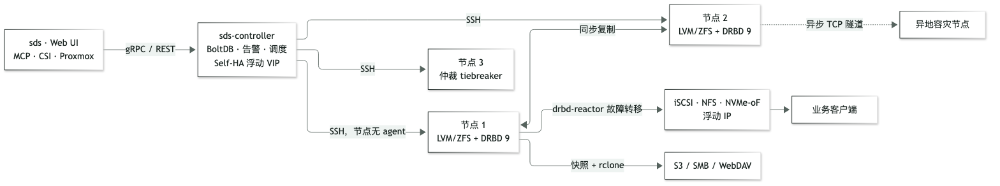

# SDS - 软件定义存储

用 Go 编写的轻量级 DRBD 9 存储控制器。管理存储池、复制卷、iSCSI / NFS / NVMe-oF 网关和高可用,并接入 Kubernetes(CSI)、Proxmox VE 和 AI 助手(MCP)。

[English](README.md) | 简体中文



存储节点上不跑 agent:一个控制器通过 SSH 驱动所有节点,状态存在内嵌的 BoltDB 里。控制器自己也可以跑在浮动 VIP 后面(Self-HA)。

## 功能

- **存储池**:LVM、LVM-thin、ZFS,thin 池支持 SSD 缓存。
- **资源**:DRBD 复制卷,自动放置、在线扩容、无盘客户端、仲裁 tiebreaker、LUKS2 静态加密。
- **网关**:iSCSI、NFS、NVMe-oF,由 drbd-reactor 加浮动 IP 做故障转移。
- **快照与备份**:LVM / ZFS 快照和保留策略;全量备份到 S3、SMB 或 WebDAV。
- **跨站点**:通过可穿透 NAT 的 TCP 隧道做异步容灾副本。
- **数据完整性**:定时 DRBD verify 并可重同步,对副本降级、Primary 丢失、数据不同步、存储池写满发出告警。
- **Kubernetes**:CSI 驱动,支持快照、克隆、扩容、原始块设备和远程(无盘)访问。
- **AI**:面向 Claude Code、ChatGPT 等的 MCP 服务(本地,或带角色令牌和 OAuth 的远程),以及 Web UI 里的 Copilot。
- **运维**:令牌认证、RBAC、审计日志、TLS、Prometheus 指标,通知可发到飞书 / Slack / 企业微信 / 钉钉 / Webhook。

## 安装

存储节点需要 DRBD 9(内核模块和 `drbd-utils`)、`drbd-reactor`、`resource-agents`,以及 LVM 和/或 ZFS。控制器所在机器需要 Go 1.25+。

```bash
make build
./scripts/deploy-all.sh --hosts "node1,node2,node3"
```

详细步骤见 [docs/deployment-guide.md](docs/deployment-guide.md),节点要求见 [docs/node-prerequisites.md](docs/node-prerequisites.md)。

## 使用

```bash
sds-cli node register --name node1 --address 192.168.1.11
sds-cli pool create --name pool0 --type lvm-thin --nodes node1,node2 --devices /dev/sdb
sds-cli resource create --name data --port 7001 --size 10G --nodes node1,node2 --pool pool0
sds-cli gateway nfs create --resource data --service-ip 192.168.1.200/24 --export-path /data
```

Kubernetes:`kubectl apply -f deploy/k8s/`,然后使用 `sds-drbd` StorageClass(见 [deploy/k8s/README.md](deploy/k8s/README.md))。

AI 助手:

```bash
claude mcp add sds -- sds-mcp --controller node1:3374            # 本地
claude mcp add --transport http sds https://<host>/mcp \
    --header "Authorization: Bearer <token>"                     # 远程
```

## 端口

| 端口 | 服务 |
| ---- | ---- |
| 3374 | gRPC(`sds-cli`、CSI、MCP) |
| 3375 | REST |
| 3376 | Web UI |
| 9433 | Prometheus |

控制器配置:`/etc/sds/controller.toml`。

## 文档

| 文档 | 内容 |
| ---- | ---- |
| [docs/user-guide.md](docs/user-guide.md) | 日常使用和排障,从这里开始。 |
| [docs/deployment-guide.md](docs/deployment-guide.md) | 从零搭建集群。 |
| [docs/node-prerequisites.md](docs/node-prerequisites.md) | 每个节点需要装什么。 |
| [docs/mcp.md](docs/mcp.md) | 本地和远程 MCP、令牌、运维手册。 |

## 许可证

Apache License 2.0
